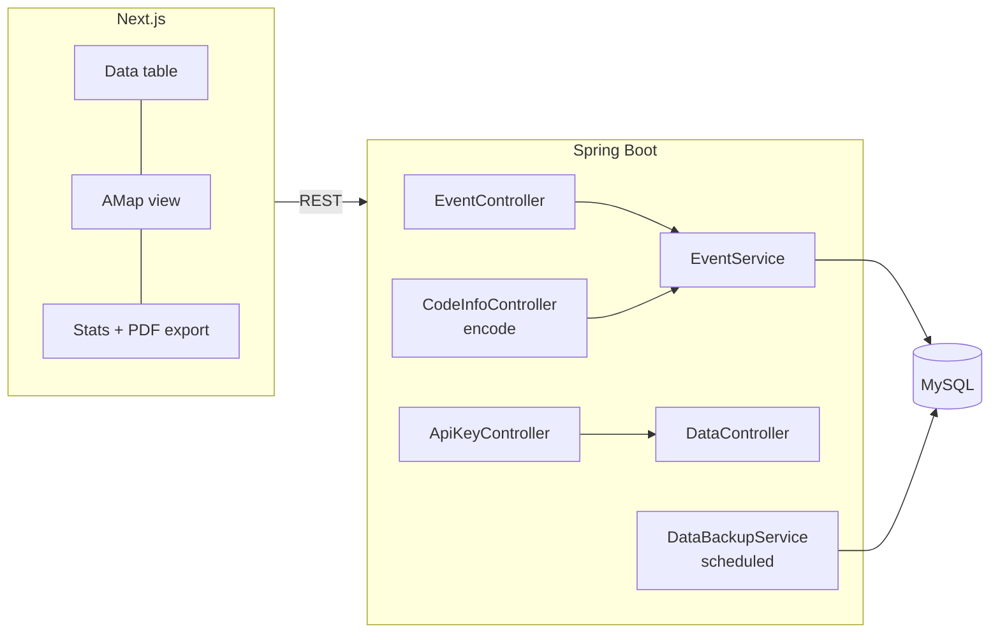

# MSHD: multi-source disaster data platform

A platform for collecting disaster reports that arrive from many sources in many shapes, giving each one a structured event code, and turning the collection into maps, statistics and reports. Built for the BUPT software engineering course (fall 2024).

## What it does

- **Unified event coding.** Every record is encoded from its region, time, source category and subcategory, carrier (text, image, audio, video, other), and disaster category, subcategory and indicator, so reports from different channels share one schema and one key.
- **Many ways in.** Single records through a form, batch import from Excel files, and media uploads attached to an event.
- **Look at it.** A filterable data table, an AMap view with events placed by region, and a statistics page built with Recharts.
- **Get it out.** Export a statistics page as a PDF report, or pull data programmatically with a generated API key.
- **Keep it safe.** Session-based login, plus scheduled database backups with a configurable time window and manual trigger and reset.



## Run it

Backend: Java 17, Maven and MySQL 5.7+.

```bash
mysql -u root -p exp < exp_region.sql
mysql -u root -p exp < exp_event.sql
./mvnw spring-boot:run
```

Set the database and upload paths in `src/main/resources/application.properties`.

Frontend:

```bash
npm install
NEXT_PUBLIC_AMAP_API_KEY=your_key npm run dev
```

## Project notes

- Team of four. I worked on the event API and its service and mapper layers, the backup service, the data table and the dashboard.
- Built over three iterations in November and December 2024 and not maintained.

## Stack

Java, Spring Boot, Spring Security, MyBatis, Spring Data JPA, Apache POI, MySQL, TypeScript, Next.js, Recharts, AMap JS API, jsPDF.
